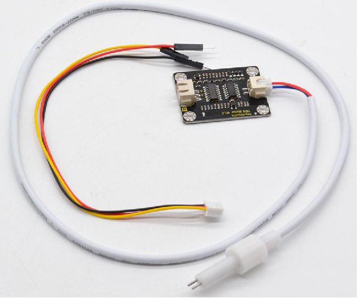
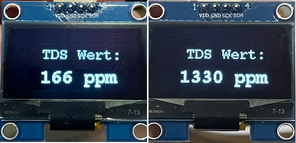

# Wasseranalyse
Wasseranalyse mit einem TDS-Sensor

## Story

Mit diesem Projekt wird der TDS-Wert von Wasser in ppm auf einem OLED-Display angezeigt. Bei einer TDS Messung wird die elektrische Leitfähigkeit des Wassers gemessen, d.h. die elektrisch geladenen Moleküle (Ionen), werden gemessen. Im Fall von Trinkwasser wären das die darin am häufigsten vorkommenden leitfähigen Stoffe, z.B. Metalle, Mineralien, Salze usw. Dadurch, dass das Wasser selbst nicht geladen ist, wird ausschließlich die Leitfähigkeit und somit die Anzahl der Ionen im Wasser gemessen.
Die TDS-Konzentration wird üblicherweise in Teilen pro Million (ppm) oder Milligramm pro Liter (mg/L) gemessen und je nach Anwendung ist ein anderer Wert erstrebenswert. Während bspw. der TDS-Gehalt für Trinkwasser weniger als 500 ppm betragen sollte, sollte der TDS-Gehalt in Hydrokultursystemen mit Fruchtpflanzen wie Tomaten und Gurken bei etwa 1000-1200 ppm liegen. Indem wir diese Werte regelmäßig messen, können wir reagieren und z.B. Nährstoffe hinzufügen.

## Hardware

Die Stückliste für die Wasserqualitäts-Anzeige:

| Anzahl | Bezeichnung | 
| -------- | -------- | 
|  1 |  ESP32  |
|  1 |  TDS-Sensor  |
|  1 |  OLED-Display 1,3"  |
|   | Kleinmaterial, Schaltdraht   |
| ---  | ---   |

## Verdrahtung

ESP32 - TDS Sensor:

| ESP32 | TDS Sensor | 
| -------- | -------- | 
|  GND | GND  |
|  +5V |  +5V  |
|  GPIO27 |  Signal  |
| ---  | ---   |

ESP32 - OLED Display 1,3":

| ESP32 | OLED Display 1,3| 
| -------- | -------- | 
|  GND | GND  |
|  +5V |  +5V  |
|  SCL	 |  SCK	  |
|  SDA	 |  SDA	  |
| ---  | ---   |

   
<ol class="breadcrumb" style="border-top: 2px solid black;border-bottom:2px solid black; height: 45px; width: 900px;"> 
<a href="#oben">nach oben</a>
</ol>

 

